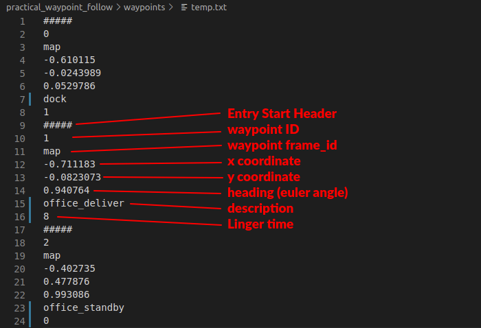
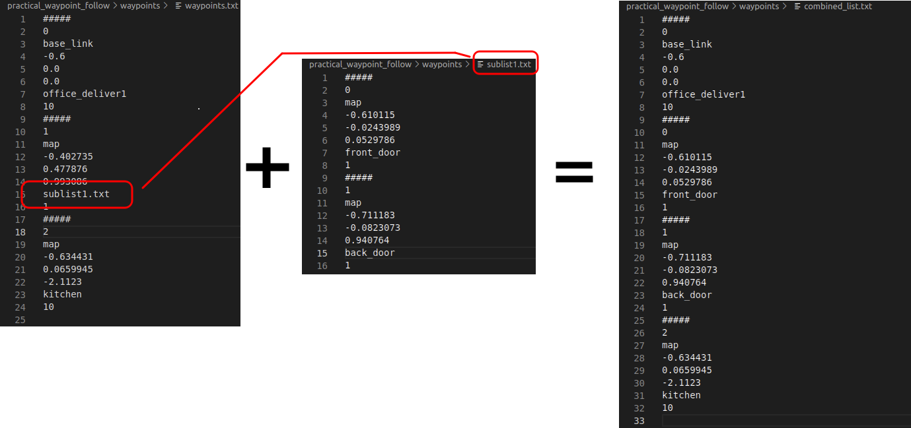
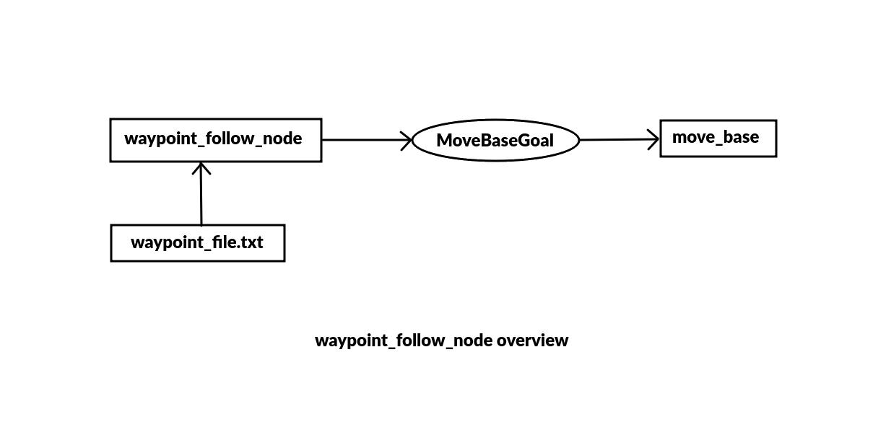
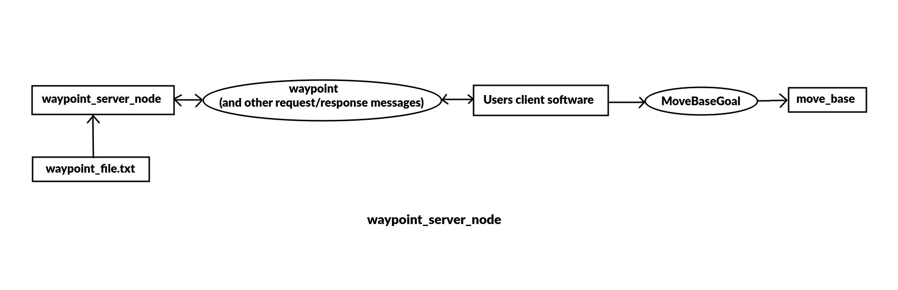

# practical_waypoint_follow
A package of ROS nodes to facilitate following lists of waypoints. 

## Purpose/Motivation:
The only other existing waypoint follower package that I am aware of ([follow_waypoints](http://wiki.ros.org/follow_waypoints)) is not very versatile. A waypoint follower is needed that allows the robot to pause for user-defined times at each waypoint as necessary. Additionally, a ROS service that can load different waypoint list files upon request and supply waypoints on the demand of a robot behavior manager is needed. Finally, the waypoint file should be easily human-readable. 

 
 

## Overview:
Both the waypoint_follow_node and the waypoint_server_node read a list of waypoints from a text file, [specified below](#waypoint-file-specification). The [waypoint_follow_node](#waypoint_follow_node) directly sends one waypoint after the other to the move_base action server, while the [waypoint_server_node](#waypoint_server_node) instead only sends a waypoint as a response to a service request from another node. A [waypoint_saver](#waypoint_saver) node allows either manual entry of waypoints, or the recording of current location as a waypoint. Finally, a [waypoint_server_client](#waypoint_server_client) node has been added to show examples of how to use the waypoint_server_node in another program.
  

## Waypoint File Specification
A text file with waypoints data listed in the order that they should be executed. Each entry starts with "#####" as  a start identifier string and entry elements are listed in the following order:
 
- Start String:  Always #####
- Waypoint ID: An integer. Users could use this to label waypoints with unique IDs. This does not affect the order of execution of waypoints, and that is done by order of listing. 
- Waypoint frame_id:  A string that indicates the frame of reference the waypoint is in. This would usually be "map" but might be "base_link" if you want the robot to move a certain distance/direction from wherever it currently is instead of to an absolute location. It might be "gps" or "utm" if you want the robot to go to a globally defined location.
- x coordinate: Float: the x coordinate
- ycoordinate:  Float: the y coordinate
- Heading:  Float: The euler angle (-3.14 to +3.14) that represents the desired heading at the waypoint
- Description: String to describe the waypoint
- Linger Time: Integer: The number of seconds the robot should pause at this waypoint before moving on to the next
 

The example waypoint file below has three entries:
 

  

**Sublists can be inserted** into a list being built by the waypoint_server_node (but currently not waypoint_follow_node) by putting the filename in the description of a waypoint entry. The other elements of that waypoint entry must be present, but are ignored. In the image below,  the result of loading waypoints.txt would be to insert sublist1.txt into the second element. The resulting list would be the same as if combined_list.txt were loaded. 

 

# waypoint_follow_node
**Description**

Loads the specified waypoint list and calls the [move_base](http://wiki.ros.org/move_base) action server with [move_base_msgs/MoveBaseGoal](http://docs.ros.org/en/fuerte/api/move_base_msgs/html/msg/MoveBaseGoal.html) message. Upon reciept of a result (whether successful or failure), the next goal in the list is issued. 
 

  

**Starting**

By default, the node looks for a file called waypoints.txt. The node optionally accepts a valid filename passed as an argument. The file must be located in the waypoints folder within this package. Parameters need to be listed after the filename argument, if there is one. These are all valid commands to start the node:

- rosrun practical_waypoint_follow waypoint_follow_node
- rosrun practical_waypoint_follow waypoint_follow_node delivery_waypoints.txt
- rosrun practical_waypoint_follow waypoint_follow_node _loop:=true
- rosrun practical_waypoint_follow waypoint_follow_node delivery_waypoints.txt _loop:=true

**Subscribes**
- none

**Publishes**
- none

**Parameters**
- bool loop - if true keep looping through the list. Default false.
- bool return - if true return to waypoint 0 when done with list. Ignored if loop is true. Default false.

 

# waypoint_server_node
**Description**

The waypoint_server node provides waypoints from a list to service clients. Services are provided to facilitate loading, serving, and manipulating waypoint lists that are built from text files that follow the [waypoint file specification](#waypoint-file-specification) above. Waypoint_server has the ability to include a list within a list (from two or more separate waypoint files) by simply including a list filename in the description element of any waypoint. The "sublist" is then inserted into that location. See the [waypoint file specification](#waypoint-file-specification) above for an example.
 

  

**Starting**

By default, the node looks for a file called waypoints.txt. The node optionally accepts a valid filename passed as an argument. The file must be located in the waypoints folder within this package. These are valid commands to start the node:

- rosrun practical_waypoint_follow waypoint_follow_node
- rosrun practical_waypoint_follow waypoint_follow_node delivery_waypoints.txt

**Subscribes**
- none

**Publishes**
- none

**Parameters**
- loop - bool(default false). If true, keeps looping when end of list is reached, if false getNextWaypoint just returns the last waypoints with a modified description
- reverse_headings - bool(default false). Only active if reverse_list service is called. If true, the order of the waypoints are reversed but the headings remain the same. If true, reverse_list reverses the order of the waypoints AND the goal headings, so a waypoint with a goal heading of 1.57 rads will end up with a heading of -1.57 after reversal. 
  

**Services Provided**
- add_waypoint - Adds the provided waypoint to the index designated. Index of -1 adds waypoint to the back fo the list. Returns the size of the new waypoint list.
  - Service Message type: practical_motion_msgs/AddWaypoint.srv
    - Request:
      - int16 index
      - Waypoint wpt
    - Response
      - int16 numWaypoints
- get_next_waypoint - Returns the next waypoint in the list and automatically increments. TIf the last waypoint in the list has already been served, the last waypoint is sent again but the description wil be changed to "END OF LIST REACHED."
  - Service Message type: practical_motion_msgs/GetNextWaypoint.srv
    - Request:
      - none
    - Response
      - Waypoint wpt
- get_current_waypoint - Returns the waypoint that was most recently sent via get_next_waypoint or get_random_waypoint service. Does not change the "next" waypoint to be served if the GetNextWaypoint is also being used.
  - Service Message type: practical_motion_msgs/GetCurrentWaypoint.srv
    - Request:
      - none
    - Response
      - Waypoint wpt
- get_random_waypoint - Returns a random waypoint from the currently loaded list. Does not change the "next" waypoint to be served if the GetNextWaypoint is also being used.
  - Service Message type: practical_motion_msgs/GetRandomWaypoint.srv
    - Request:
      - none
    - Response
      - Waypoint wpt
- load_list - Clears the waypoint list and loads the file provided in the request. Returns the number of waypoints in the new list.
  - Service Message type: practical_motion_msgs/LoadList.srv
    - Request:
      - string listName
    - Response
      - int16 numWaypoints
- reverse_list - Reverses the order of the entire list.
  - Service Message type: std_msgs/Empty.srv
    - Request:
      - none
    - Response
      - none
  
 

# waypoint_saver
**Description**

A command line tool to create waypoint list files. The user can select to manually enter a waypoint or to grab the current location and orientation as a waypoint. Upon exiting, the waypoint list is formatted and saved for use by waypoint_follow_node or waypoint_server_node. 

**Starting**

Waypoint_saver takes no arguments or parameters and is easily started from the command line with rosrun. 
- rosrun practical_waypoint_follow waypoint_saver

**Subscribes**
- none, but the current location is determined by looking up transform data from the desired frame to the robot's base frame, so the transform tree must be complete from the desired frame to the robot's base frame.

**Publishes**
- none

**Parameters**
- none

 

# waypoint_server_client
**Description**

Waypoint_server_client.cpp is intended to provide examples for how to use the services provided by the waypoint_server_node and how to send the waypoints as goals to move_base. When run, it will call each of the services provided by waypoint_server_node, output some results, and exit. At the end of the main() function of waypoint_server_client.cpp, there is a section that, if uncommented, will send a goal to the move_base action server. The code examples you can use to implement use of the waypoint_server_node in your own programs are more important than anything this node actually does when run.

**Starting**
- rosrun practical_waypoint_follow waypoint_server_client

**Subscribes**
- none

**Publishes**
- none

**Parameters**
- none

 

## Contributing, bug reports, etc:
If you find my tutorials and projects helpful, consider supporting the development of this and others at [BuyMeACoffee](https://www.buymeacoffee.com/practicalrobot).
Please use the issues and bug reporting system for bugs and feature requests. With many projects, a job, a family, I can't promise to get to feature requests very quickly, but am definitely listening for feedback to make improvement and will prioritize bugs. I am open to pull requests if you'd like to contribute. I can be contacted by email at lbrombach2@gmail.com. 